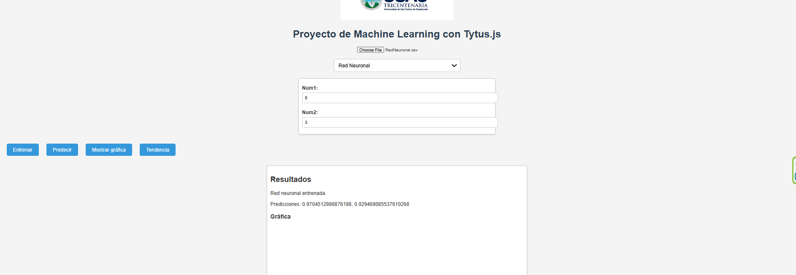

# Manual de Usuario

## Introducción
Este manual de usuario proporciona instrucciones para cargar archivos CSV en el sistema y generar resultados utilizando los diferentes modelos de machine learning implementados en el proyecto. Se describen los pasos a seguir y se dejan espacios para que se integren capturas de pantalla de la interfaz.

## Carga de Datos
1. **Carga del Archivo CSV**
   - Haga clic en el botón "Cargar CSV" y seleccione el archivo CSV correspondiente desde su computadora.
   - Una vez cargado, los datos aparecerán en la sección de resultados.
   - 

## Modelos Disponibles
Los modelos implementados son:

1. **Regresión Lineal**
   - Para generar resultados con el modelo de regresión lineal, siga estos pasos:
     1. Seleccione "Regresión Lineal" en el menú de modelos.
     2. Haga clic en el botón "Entrenar".
     3. Luego haga clic en "Predecir" para obtener los resultados.
   - Los resultados se mostrarán en la sección de resultados.
   - 

2. **Regresión Polinómica**
   - Para utilizar el modelo de regresión polinómica:
     1. Seleccione "Regresión Polinómica" en el menú.
     2. Haga clic en "Entrenar".
     3. Luego haga clic en "Predecir".
   - Los resultados se mostrarán junto con un gráfico de la regresión.
   - 

3. **Árbol de Decisión**
   - Para trabajar con el modelo de árbol de decisión:
     1. Seleccione "Árbol de Decisión" en el menú.
     2. Haga clic en "Entrenar".
     3. Luego haga clic en "Predecir".
   - Los resultados se mostrarán en la sección de resultados.
   - 

4. **Naive Bayes**
   - Para el modelo de Naive Bayes:
     1. Seleccione "Naive Bayes" en el menú.
     2. Haga clic en "Entrenar".
     3. Luego haga clic en "Predecir".
   - Los resultados se mostrarán en la sección de resultados.
   - 

5. **Red Neuronal**
   - Para el modelo de red neuronal:
     1. Seleccione "Red Neuronal" en el menú.
     2. Haga clic en "Entrenar".
     3. Luego haga clic en "Predecir".
   - Los resultados se mostrarán en la sección de resultados.
   - 

6. **K-Means**
   - Para el modelo de K-Means:
     1. Seleccione "K-Means" en el menú.
     2. Haga clic en "Tendencia" para visualizar los clusters generados.
   - Los resultados se mostrarán en la sección de resultados.
   - 
   - 

7. **K-Vecinos Más Cercanos (KNN)**
   - Para trabajar con el modelo KNN:
     1. Seleccione "KNN" en el menú.
     2. Haga clic en "Tendencia".
   - Los resultados de las distancias Euclidianas y Manhattan se mostrarán en la sección de resultados.
   - 

## Conclusiones
Este manual proporciona los pasos básicos para cargar datos y generar resultados utilizando los modelos implementados. Para cualquier duda o problema, consulte la documentación adicional o el soporte técnico.

